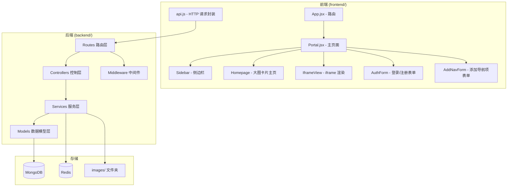

# 设计文档

## 概述

将现有的纯前端 React 导航门户升级为全栈应用。前端代码位于 `frontend/` 目录，后端代码位于 `backend/` 目录。后端采用 Node.js + Express + MongoDB + Redis 技术栈，提供 RESTful API。前端通过 Vite 代理将 API 请求转发到后端。

核心改造点：
- 将硬编码的 `siteInfo` 替换为从后端 API 动态获取的导航数据
- 新增用户认证系统（邮箱验证码注册 + JWT 登录）
- 新增导航项 CRUD 功能，支持公共/私有权限控制
- 新增背景图片上传功能
- 主页改为大图卡片式导航展示

## 架构



### 前后端通信

前端通过 Vite 的 `proxy` 配置将 `/api` 前缀的请求代理到后端（默认 `http://localhost:3001`）。生产环境可通过 Nginx 反向代理实现。

### 后端分层架构

| 层级 | 职责 | 目录 |
|------|------|------|
| Routes | 定义 API 路径和 HTTP 方法，绑定中间件 | `backend/routes/` |
| Controllers | 解析请求参数，调用 Service，返回响应 | `backend/controllers/` |
| Services | 业务逻辑实现 | `backend/services/` |
| Models | Mongoose Schema 定义 | `backend/models/` |
| Middleware | JWT 验证、管理员权限检查 | `backend/middleware/` |

## 组件与接口

### 后端 API 接口

#### 认证接口

| 方法 | 路径 | 描述 | 认证 |
|------|------|------|------|
| POST | `/api/auth/send-code` | 发送邮箱验证码 | 无 |
| POST | `/api/auth/register` | 邮箱验证码注册 | 无 |
| POST | `/api/auth/login` | 邮箱密码登录 | 无 |
| GET | `/api/auth/me` | 获取当前用户信息 | JWT |

#### 导航项接口

| 方法 | 路径 | 描述 | 认证 |
|------|------|------|------|
| GET | `/api/nav-items` | 获取导航列表 | 可选 JWT |
| POST | `/api/nav-items` | 添加导航项 | JWT |
| DELETE | `/api/nav-items/:id` | 删除导航项 | JWT |

#### 上传接口

| 方法 | 路径 | 描述 | 认证 |
|------|------|------|------|
| POST | `/api/upload/image` | 上传背景图片 | JWT |

#### 静态文件

| 路径 | 描述 |
|------|------|
| `/images/:filename` | 访问上传的背景图片 |

### 前端组件

#### Portal.jsx（改造）
- 管理全局状态：当前视图（主页/iframe）、用户登录状态、导航列表
- 点击"莲花导航"标题切换到主页视图
- 点击侧边栏导航项切换到 iframe 视图或打开新标签页

#### Homepage.jsx（新增）
- 大图卡片网格布局展示导航项
- 每张卡片：背景图 + 标题 + 描述 + emoji logo
- 顶部用户信息栏：未登录显示登录按钮，已登录显示邮箱和登出按钮
- 已登录时显示"添加导航"按钮

#### AuthForm.jsx（新增）
- 模态框形式的登录/注册表单
- 登录模式：邮箱 + 密码
- 注册模式：邮箱 + 密码 + 验证码（含发送验证码按钮，60秒倒计时）

#### AddNavForm.jsx（新增）
- 模态框形式的添加导航项表单
- 字段：地址、标题、描述、emoji logo、显示模式、背景图片上传
- 管理员额外显示"公共项目"开关

#### Sidebar.jsx（改造）
- 从后端动态获取导航列表替代硬编码 siteInfo
- 点击"莲花导航"标题触发切换到主页
- 根据导航项的显示模式决定行为（iframe 或新标签页）

#### api.js（新增）
- 封装所有后端 API 调用
- 自动附加 JWT token 到请求头
- 统一错误处理

### 后端组件

#### AuthController / AuthService
- `sendCode`: 生成6位验证码 → 检查 Redis 60秒限制 → 存入 Redis（5分钟过期）→ 发送邮件
- `register`: 验证验证码 → 检查邮箱唯一性 → 创建用户（密码 bcrypt 加密）
- `login`: 验证邮箱密码 → 生成 JWT token
- `getMe`: 根据 JWT 中的 userId 返回用户信息

#### NavItemController / NavItemService
- `getNavItems`: 未登录返回公共项；已登录返回公共项 + 该用户私有项
- `createNavItem`: 验证权限（普通用户不能创建公共项）→ 创建导航项
- `deleteNavItem`: 验证所有权 → 删除导航项

#### UploadController / UploadService
- `uploadImage`: 使用 multer 接收文件 → 验证格式 → 生成随机文件名（uuid）→ 保存到 images/ → 返回文件名

#### Middleware
- `authMiddleware`: 解析 JWT token，将 userId 注入 req.user
- `optionalAuthMiddleware`: 同上但不强制，未登录时 req.user 为 null
- `adminMiddleware`: 检查 req.user.is_admin 是否为 true

## 数据模型

### User 模型（users 集合）

```javascript
{
  email: { type: String, required: true, unique: true },
  password: { type: String, required: true },  // bcrypt 加密
  is_admin: { type: Boolean, default: false },
  created_at: { type: Date, default: Date.now }
}
```

### NavItem 模型（nav_items 集合）

```javascript
{
  url: { type: String, required: true },
  title: { type: String, required: true },
  description: { type: String, default: '' },
  emoji: { type: String, default: '🔗' },
  display_mode: { type: String, enum: ['iframe', 'redirect'], required: true },
  is_public: { type: Boolean, default: false },
  user_id: { type: ObjectId, ref: 'User', default: null },  // 公共项为 null
  bg_image: { type: String, default: '' },  // 图片文件名
  created_at: { type: Date, default: Date.now }
}
```

### 后端配置文件（config.json）

```json
{
  "port": 3001,
  "mongodb": {
    "url": "mongodb://localhost:27017/nav_portal"
  },
  "redis": {
    "host": "localhost",
    "port": 6379,
    "username": "",
    "password": ""
  },
  "jwt": {
    "secret": "your-jwt-secret-key",
    "expiresIn": "7d"
  },
  "email": {
    "host": "smtp.example.com",
    "port": 465,
    "secure": true,
    "user": "",
    "pass": ""
  }
}
```

### 后端目录结构

```
backend/
├── config.json
├── package.json
├── app.js                  # Express 应用入口
├── images/                 # 上传的背景图片
├── middleware/
│   └── auth.js             # JWT 验证、管理员权限中间件
├── models/
│   ├── User.js
│   └── NavItem.js
├── routes/
│   ├── auth.js
│   ├── navItem.js
│   └── upload.js
├── controllers/
│   ├── authController.js
│   ├── navItemController.js
│   └── uploadController.js
└── services/
    ├── authService.js
    ├── navItemService.js
    └── uploadService.js
```

### 前端目录结构变更

```
frontend/src/
├── api.js                  # API 请求封装（新增）
├── components/
│   ├── AuthForm.jsx        # 登录/注册表单（新增）
│   ├── AddNavForm.jsx      # 添加导航项表单（新增）
│   ├── NavCard.jsx         # 导航卡片组件（新增）
│   ├── Sidebar.jsx         # 改造：动态数据
│   ├── IframeView.jsx      # 保留
│   ├── Loader.jsx          # 保留
│   └── ToggleSidebar.jsx   # 保留
├── pages/
│   ├── Portal.jsx          # 改造：状态管理
│   └── Homepage.jsx        # 主页大图卡片（新增）
├── css/
│   ├── components/
│   │   ├── AuthForm.module.css     # 新增
│   │   ├── AddNavForm.module.css   # 新增
│   │   └── NavCard.module.css      # 新增
│   └── pages/
│       └── Homepage.module.css     # 新增
└── ...
```


## 正确性属性

*正确性属性是指在系统所有有效执行中都应成立的特征或行为——本质上是关于系统应该做什么的形式化陈述。属性作为人类可读规范与机器可验证正确性保证之间的桥梁。*

### Property 1: 验证码格式正确性
*For any* 验证码生成请求，生成的验证码应为恰好6位的纯数字字符串。
**Validates: Requirements 1.1**

### Property 2: 验证码发送频率限制
*For any* 邮箱地址，在发送验证码后60秒内再次请求，第二次请求应被拒绝。
**Validates: Requirements 1.3**

### Property 3: 错误验证码拒绝注册
*For any* 注册请求，如果提交的验证码与 Redis 中存储的验证码不匹配，注册应失败并返回错误信息。
**Validates: Requirements 1.5**

### Property 4: JWT 认证往返一致性
*For any* 有效用户，登录后返回的 JWT token 应能被 auth 中间件正确解析，提取出的 userId 应与登录用户一致。
**Validates: Requirements 2.1, 2.3**

### Property 5: 无效凭证拒绝登录
*For any* 不存在的邮箱或错误的密码组合，登录请求应返回错误信息。
**Validates: Requirements 2.2**

### Property 6: 无效 JWT 返回401
*For any* 格式错误或已过期的 JWT token，auth 中间件应返回401状态码。
**Validates: Requirements 2.4**

### Property 7: 导航项可见性规则
*For any* 数据库中的导航项集合和任意用户，已登录用户获取的列表应恰好包含所有公共项加上该用户的私有项；未登录请求应仅返回公共项。
**Validates: Requirements 3.1, 3.2, 3.4**

### Property 8: 普通用户无法创建公共项
*For any* is_admin 为 false 的用户，尝试创建 is_public 为 true 的导航项应被拒绝。
**Validates: Requirements 3.5**

### Property 9: 上传文件名唯一性
*For any* 两次图片上传操作，生成的文件名应互不相同。
**Validates: Requirements 4.1**

### Property 10: 非图片格式拒绝上传
*For any* 文件扩展名不在 [jpg, jpeg, png, gif, webp] 范围内的上传请求，应被拒绝。
**Validates: Requirements 4.3**

### Property 11: 导航卡片渲染完整性
*For any* 导航项数据，主页渲染的卡片应包含该导航项的背景图、标题和描述信息。
**Validates: Requirements 5.2**

### Property 12: 侧边栏导航项渲染完整性
*For any* 导航项数据，侧边栏渲染应包含该导航项的 emoji logo 和标题。
**Validates: Requirements 6.5**

### Property 13: 必填字段验证
*For any* 缺少 url 或 title 字段的导航项创建请求，应被拒绝并返回验证错误。
**Validates: Requirements 7.4**

## 错误处理

### 后端错误处理

| 场景 | HTTP 状态码 | 响应格式 |
|------|------------|---------|
| 验证码发送频率限制 | 429 | `{ error: '请60秒后再试' }` |
| 验证码错误或过期 | 400 | `{ error: '验证码错误或已过期' }` |
| 邮箱已注册 | 409 | `{ error: '该邮箱已注册' }` |
| 邮箱或密码错误 | 401 | `{ error: '邮箱或密码错误' }` |
| JWT 无效或过期 | 401 | `{ error: '未授权' }` |
| 权限不足（非管理员创建公共项） | 403 | `{ error: '权限不足' }` |
| 必填字段缺失 | 400 | `{ error: '缺少必填字段', fields: [...] }` |
| 图片格式不支持 | 400 | `{ error: '不支持的图片格式' }` |
| 服务器内部错误 | 500 | `{ error: '服务器内部错误' }` |

### 前端错误处理

- API 请求失败时显示 toast 提示
- JWT 过期时自动清除本地 token 并跳转到未登录状态
- 图片上传失败时提示用户重试
- 网络错误时显示友好的错误提示

## 测试策略

### 双重测试方法

本项目采用单元测试与属性测试相结合的方式：

- **单元测试**：验证具体示例、边界情况和错误条件
- **属性测试**：验证在所有输入上成立的通用属性

### 属性测试配置

- 使用 **fast-check** 作为 JavaScript 属性测试库
- 每个属性测试至少运行 **100 次迭代**
- 每个属性测试必须用注释引用设计文档中的属性编号
- 标签格式：**Feature: navigation-portal-fullstack, Property {number}: {property_text}**
- 每个正确性属性由一个独立的属性测试实现

### 测试框架

- 后端：**Jest** + **fast-check**
- 前端：**Vitest** + **@testing-library/react** + **fast-check**

### 测试覆盖范围

| 测试类型 | 覆盖内容 |
|---------|---------|
| 属性测试 | 验证码生成格式、频率限制、JWT 往返、导航项可见性、权限控制、文件名唯一性、格式验证、字段验证 |
| 单元测试 | 具体的注册/登录流程、邮箱重复检查、导航项 CRUD 操作、图片上传成功路径 |
| 集成测试 | API 端到端流程、中间件链路、数据库操作 |
